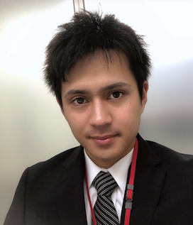

# Masaki Iida
## Contact Info:  [Email](mailto:masakiiida@outlook.com)
## Education
 - **Palomar College**
AS, Computer Science - Present
 - **Miracosta College**
Conmputer Science - Present

## Skills
- **Tools**: Eclipse, NetBeans, MS Visual Studio, Android Studio, Xcode, IntelliJ IDEA
- **Primary Languages**: Java
- **Secondary Languages**: C/C++, HTML, CSS, XML, Android, C#
- **Operating Systems**: Mac OS X, Windows
- **Foreign Languages**:  Fluent native Japanese speaker/writer

## Project
- **Java**
	- Created a clock program which have two functions digital and analog.
	- Created a calculator program which can change color of background and foreground of text and button.
- **C#**
	- Created a 2D shooting game program which can control on your PC's keyboard.
	
## Activities
- **Clab**
	- A captain of a Badminton club, Fall 2014 - Fall 2015.
- **Volunteer**
	- Taught English reading and writing students at an elementary school in San Marcos.
